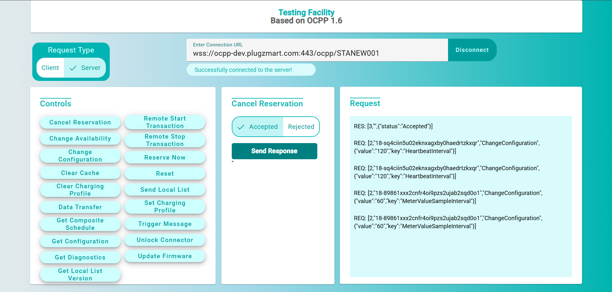
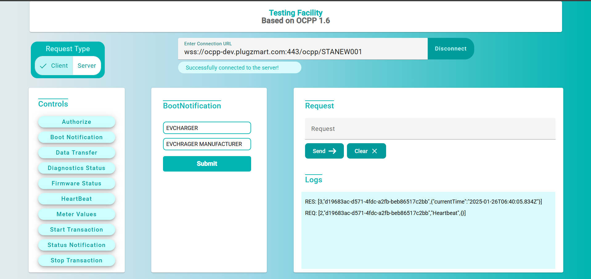
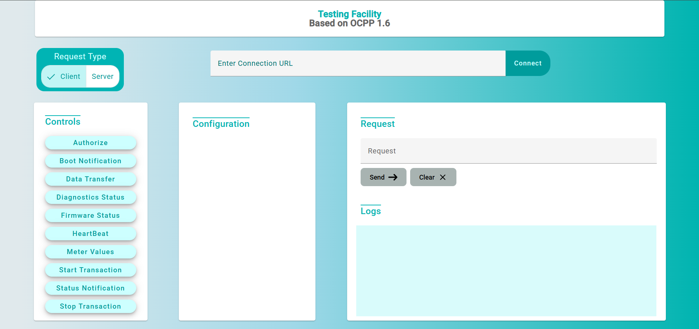
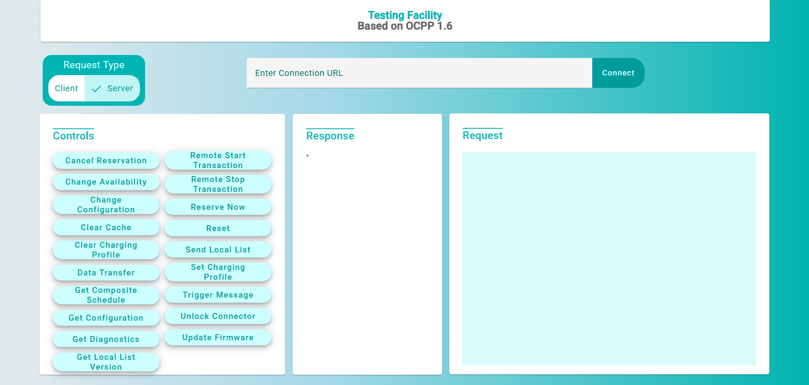

# OCPP 1.6 Server Debugging Tool

This tool helps in debugging server requests and responses in compliance with OCPP 1.6 standards. It is designed to provide a smooth and intuitive interface for tracking server communications during testing and debugging processes, Developed using Angular Web Framework 19.

## Features

- Debugging and logging of server requests and responses.
- Real-time interaction and monitoring of communication via WebSocket.
- Supports OCPP 1.6 commands.
- Displays request/response data in an easily readable format.

## Major Commands

Here are some of the key commands supported by the tool:

| Command              | Description                                             | Example Request                                                |
|----------------------|---------------------------------------------------------|---------------------------------------------------------------|
| `BootNotification`    | Used by the EVSE to notify the central system of its availability. | `{ "chargePointModel": "ModelX", "chargePointVendor": "VendorY" }` |
| `StatusNotification`  | Used to notify the central system about the status of a connector. | `{ "connectorId": 1, "status": "Available" }`                   |
| `StartTransaction`    | Indicates the start of a transaction (charging session). | `{ "connectorId": 1, "idTag": "12345", "timestamp": "2025-01-25T12:00:00Z" }` |
| `StopTransaction`     | Used to indicate the end of a transaction. | `{ "transactionId": 123, "timestamp": "2025-01-25T12:30:00Z" }` |
| `Heartbeat`           | A simple message sent periodically to check the status of the server. | `{ "interval": 60 }`                                             |

  Many other commands also present in the app. Give a try!

## How to Use

1. **Start the Tool**: Launch the app and connect it to your OCPP 1.6 server via WebSocket.
   - Ensure your server supports WebSocket connections at the appropriate endpoint.
2. **Send Requests**: Use the built-in command interface to send various OCPP commands.
3. **Monitor Responses**: The tool will display real-time responses to the sent requests.
4. **Logs**: View detailed logs of requests and responses.

## Screenshots






## Installation

To install and use the tool, follow the steps below:

### Steps to Launch the Web Application tool

```bash
git clone https://github.com/your-repository/OCPP-Charger-Simulator.git

npm install

ng serve
```

###  Contributing
Contributions are welcome! If you'd like to contribute to the project, Fork the repository and give a PR.


 


